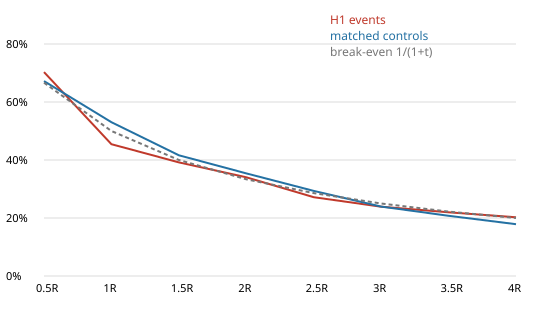
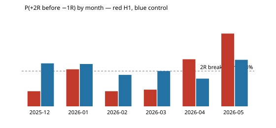

# Gold V1 — H1 event study (SWEEP + TVWAP RECLAIM)

Development data only: 2025-12-23 → 2026-06-02 (Exness XAUUSDm M15, bid); events span
2025-12-23 → 2026-05-28. No validation or final-OOS row was loaded (the loader cuts at 2026-06-03 00:00 UTC before any computation).

**Data quality gate: PASS** (details: [data_quality.md](data_quality.md)).

## Counts

- Raw sweep bars (every bar meeting the sweep condition): 920 — Asia high 259, Asia low 249, PDH 171, PDL 241.
- Valid H1 events (first sweep per trading day and reference followed by a TVWAP reclaim within 4 bars, risk > 0):
  **102**.
- Signals by month: 2025-12 7, 2026-01 21, 2026-02 16, 2026-03 21, 2026-04 18, 2026-05 19. Full months (Jan–May): mean
  19.0, median 19 per month.
- Intrabar-ambiguous events (a target and −1R inside one M15 bar, any target): 1. Events with no +2R/−1R
  resolution within 96 bars: 7. Both are excluded from the P(...) figures.
- Risk (entry − sweep extreme): median 24.19 USD, IQR 14.88–33.83,
  max 112.71; in ATR units median 2.05, IQR 1.26–2.71.
- Spread / risk: median 0.99%, 90th pct 2.68%, max
  6.81% (spread field semantics unresolved; treat as indicative).

## Breakdown — H1 events

P(+tR) = P(+tR reached before −1R), ambiguous and unresolved excluded. MFE/MAE in R over 32 bars (8 h); MFE→stop
= maximum favourable excursion until −1R (or 96 bars).

| group | n | P(+1R) | P(+2R) | P(+3R) | P(+4R) | amb | MFE32 med | MFE32 mean | MAE32 med | MAE32 mean | MFE→stop med |
|---|---|---|---|---|---|---|---|---|---|---|---|
| ALL | 102 | 45.5% | 34.0% | 23.9% | 20.2% | 1 | 0.92 | 2.10 | 1.07 | 1.71 | 0.83 |
| Asia high | 23 | 36.4% | 28.6% | 19.0% | 15.0% | 0 | 1.04 | 1.65 | 1.14 | 1.26 | 0.74 |
| Asia low | 22 | 33.3% | 20.0% | 5.0% | 5.0% | 0 | 0.68 | 1.39 | 1.07 | 1.93 | 0.63 |
| PDH | 30 | 58.6% | 50.0% | 37.0% | 30.8% | 1 | 1.77 | 3.43 | 0.92 | 1.62 | 1.77 |
| PDL | 27 | 48.1% | 32.0% | 29.2% | 26.1% | 0 | 0.78 | 1.60 | 1.29 | 2.02 | 0.59 |
| long | 49 | 41.7% | 26.7% | 18.2% | 16.3% | 0 | 0.73 | 1.50 | 1.09 | 1.98 | 0.62 |
| short | 53 | 49.0% | 40.8% | 29.2% | 23.9% | 1 | 1.10 | 2.65 | 1.06 | 1.47 | 1.00 |
| London | 16 | 25.0% | 18.8% | 12.5% | 12.5% | 0 | 0.69 | 1.42 | 1.50 | 1.88 | 0.67 |
| New York | 14 | 46.2% | 38.5% | 15.4% | 8.3% | 0 | 0.98 | 1.59 | 0.87 | 0.83 | 0.77 |
| Overlap | 32 | 43.3% | 32.1% | 21.4% | 15.4% | 1 | 0.99 | 2.06 | 1.17 | 1.71 | 0.92 |
| Asia | 22 | 45.5% | 36.8% | 33.3% | 33.3% | 0 | 0.69 | 2.15 | 0.68 | 1.50 | 0.74 |
| Other | 18 | 66.7% | 44.4% | 35.3% | 29.4% | 0 | 2.09 | 3.13 | 2.21 | 2.51 | 1.57 |

## Breakdown — matched controls

Controls: 510 bars (5 per event), same session and volatility regime, same direction and
same risk in ATR units, not within ±8 bars of any event, fixed seed 20260603.

| group | n | P(+1R) | P(+2R) | P(+3R) | P(+4R) | amb | MFE32 med | MFE32 mean | MAE32 med | MAE32 mean | MFE→stop med |
|---|---|---|---|---|---|---|---|---|---|---|---|
| ALL | 510 | 53.0% | 35.4% | 23.9% | 17.9% | 9 | 1.29 | 2.02 | 1.17 | 2.06 | 1.10 |
| Asia high | 115 | 55.4% | 36.6% | 18.2% | 16.3% | 0 | 1.08 | 1.52 | 0.87 | 1.49 | 1.12 |
| Asia low | 110 | 49.5% | 31.7% | 21.1% | 12.5% | 0 | 1.16 | 1.46 | 1.11 | 1.39 | 0.91 |
| PDH | 150 | 49.7% | 33.3% | 23.0% | 18.0% | 6 | 1.76 | 2.72 | 1.48 | 2.72 | 1.04 |
| PDL | 135 | 57.7% | 39.7% | 31.4% | 23.2% | 3 | 1.27 | 2.13 | 1.04 | 2.34 | 1.16 |
| long | 245 | 54.0% | 36.1% | 26.9% | 18.5% | 3 | 1.21 | 1.83 | 1.09 | 1.92 | 1.10 |
| short | 265 | 52.1% | 34.7% | 21.1% | 17.3% | 6 | 1.35 | 2.20 | 1.24 | 2.18 | 1.10 |
| London | 80 | 55.3% | 35.2% | 26.2% | 20.0% | 0 | 1.35 | 1.81 | 1.07 | 1.53 | 1.09 |
| New York | 70 | 52.2% | 38.2% | 27.0% | 17.9% | 1 | 1.28 | 1.69 | 1.11 | 1.50 | 1.18 |
| Overlap | 160 | 50.6% | 31.9% | 15.6% | 12.0% | 2 | 1.06 | 1.55 | 0.94 | 1.51 | 1.00 |
| Asia | 110 | 53.3% | 36.0% | 27.8% | 20.2% | 2 | 1.11 | 1.80 | 1.01 | 2.15 | 1.05 |
| Other | 90 | 55.7% | 38.2% | 27.9% | 22.6% | 4 | 2.24 | 3.58 | 2.44 | 3.82 | 1.26 |

## Edge test — events vs controls

| target | event P | n | control P | n | lift (pp) | 95% CI (event-clustered bootstrap) | break-even |
|---|---|---|---|---|---|---|---|
| +1R | 45.5% | 99 | 53.0% | 496 | -7.6 | -19.2 … +3.9 | 50.0% |
| +2R | 34.0% | 94 | 35.4% | 472 | -1.3 | -11.8 … +9.8 | 33.3% |
| +3R | 23.9% | 92 | 23.9% | 439 | -0.0 | -10.3 … +8.8 | 25.0% |
| +4R | 20.2% | 89 | 17.9% | 414 | +2.4 | -7.3 … +10.4 | 20.0% |

MFE vs MAE (32 bars, medians): events MFE 0.92R / MAE 1.07R; controls
MFE 1.29R / MAE 1.17R.

### Consistency

| month | event P(+2R) | n | control P(+2R) |
|---|---|---|---|
| 2025-12 | 14.3% | 7 | 40.6% |
| 2026-01 | 35.0% | 20 | 40.0% |
| 2026-02 | 14.3% | 14 | 29.7% |
| 2026-03 | 15.8% | 19 | 33.3% |
| 2026-04 | 44.4% | 18 | 26.2% |
| 2026-05 | 68.8% | 16 | 44.0% |

Months with event > control at +2R: 2 of 6.

| slice | lift +2R (pp) | lift +3R (pp) |
|---|---|---|
| long | -9.4 | -8.7 |
| short | +6.1 | +8.1 |
| Asia refs | -9.8 | -7.5 |
| PD refs | +5.2 | +6.4 |

## Context features (descriptive only — nothing was filtered or tuned)

| context | n | P(+2R) | MFE32 med | MAE32 med |
|---|---|---|---|---|
| regime = neutral | 56 | 39.2% | 0.80 | 0.97 |
| regime = range | 27 | 26.9% | 1.04 | 1.14 |
| regime = trend | 19 | 29.4% | 1.17 | 1.33 |
| vol_regime = high | 27 | 39.1% | 1.04 | 0.70 |
| vol_regime = low | 20 | 42.1% | 0.75 | 1.06 |
| vol_regime = mid | 55 | 28.8% | 0.74 | 1.14 |
| compression = False | 93 | 32.9% | 0.91 | 1.06 |
| compression = True | 9 | 44.4% | 2.07 | 2.59 |
| expansion = False | 74 | 34.8% | 1.04 | 1.10 |
| expansion = True | 28 | 32.1% | 0.75 | 1.05 |
| sweep_depth_atr tercile low (0.0298–0.418) | 34 | 23.5% | 0.79 | 1.14 |
| sweep_depth_atr tercile mid (0.439–0.738) | 34 | 45.2% | 1.65 | 1.12 |
| sweep_depth_atr tercile high (0.758–2.69) | 34 | 34.5% | 0.75 | 1.02 |
| reclaim_delay tercile low (0–1) | 34 | 45.5% | 2.09 | 1.26 |
| reclaim_delay tercile mid (1–2) | 34 | 25.8% | 0.93 | 1.17 |
| reclaim_delay tercile high (2–4) | 34 | 30.0% | 0.71 | 0.97 |
| tvwap_slope tercile low (-5.51–-0.0719) | 34 | 29.0% | 0.74 | 1.14 |
| tvwap_slope tercile mid (-0.0649–0.0535) | 34 | 21.2% | 0.72 | 1.21 |
| tvwap_slope tercile high (0.0563–10.2) | 34 | 53.3% | 2.05 | 0.73 |
| tv_ratio tercile low (0.331–1.03) | 34 | 21.2% | 0.69 | 1.37 |
| tv_ratio tercile mid (1.03–1.44) | 33 | 51.7% | 2.02 | 0.83 |
| tv_ratio tercile high (1.45–12.2) | 33 | 26.7% | 0.73 | 1.22 |
| risk_atr tercile low (0.46–1.54) | 34 | 42.4% | 2.28 | 1.87 |
| risk_atr tercile mid (1.58–2.43) | 34 | 30.3% | 0.72 | 1.14 |
| risk_atr tercile high (2.46–4.6) | 34 | 28.6% | 0.73 | 0.64 |
| spread_risk tercile low (0.00142–0.00712) | 34 | 27.6% | 0.66 | 0.86 |
| spread_risk tercile mid (0.00712–0.0138) | 34 | 21.9% | 0.82 | 1.17 |
| spread_risk tercile high (0.0139–0.0681) | 34 | 51.5% | 2.72 | 1.48 |

With ~100 events, context cells hold 9–93 events; a ±15 pp difference between cells is within noise
(Wilson half-width at n = 30 is about ±17 pp). These rows are recorded for later hypotheses, not for selection.

## Decision: **NO EDGE**

Pre-registered rule (methodology.md): PROMISING needs a +2R lift ≥ 5 pp over the matched control with the
95% CI above 0, event > control in at least 4 of 6 months, and a positive +2R lift in long, short, Asia-reference and
PD-reference slices. WEAK = positive lift that fails those tests. NO EDGE = no positive lift at +2R or +3R.

Observed: +2R lift -1.3 pp (CI -11.8 … +9.8), +3R lift
-0.0 pp (CI -10.3 … +8.8), 2/6 months positive.

## Interpretation

- H1 events reach +tR before −1R at the same rate as ordinary M15 bars in the same session and volatility regime,
  with the same direction and the same ATR-scaled stop. The sweep + TVWAP reclaim adds nothing measurable at +2R/+3R;
  at +1R it is worse (-7.6 pp), and median 32-bar MFE is lower than the control's
  (0.92R vs 1.29R) with similar MAE — the favourable-MFE-vs-MAE criterion also fails.
- Raw event P(+2R) (34.0%) sits on the 1:2 break-even (33.3%) before spread and commission.
- The sign is not stable in time: Dec–Mar every month is below control, Apr–May above. That is a regime pattern in
  the underlying market, not a property of the setup.
- Short / PD-reference slices show +5 … +8 pp and long / Asia-reference slices −8 … −10 pp. These are post-hoc
  subsets of a null overall result, each with n ≈ 50 and CIs spanning ±15 pp; they are **not** grounds to keep H1 and
  must not be promoted to filters. The context-feature terciles are recorded for the feature library only.
- Per the brief, validation and final-OOS data were not inspected and will not be used to rescue H1. H1 stops here.
