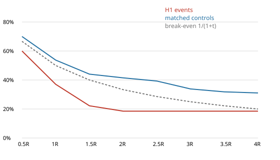
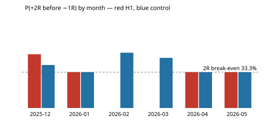

# Gold V1 — H2 event study (TREND PULLBACK TO TVWAP)

- **Data:** development data only, 2025-12-23 → 2026-06-02 (Exness XAUUSDm M15, bid). Events span
  2025-12-29 → 2026-05-29. Validation and final OOS were not loaded.
- **Rules:** implemented exactly as frozen in [preregistration.md](preregistration.md) (SHA-256 89e22514…, frozen
  before any H2 outcome was computed).
- **Data quality gate: PASS.** All 12 H1 checks were rerun, plus 3 H2 checks; see [data_quality.md](data_quality.md).

## Counts

| stage | long | short | total |
|---|---|---|---|
| pullback sequences started (new session extreme with ≥ 1 eligible zone) | 916 | 598 | 1514 |
| unique pullback sequences (first touch of a zone while in the trend regime) | 65 | 41 | 106 |
| raw qualifying bars (regime + touch + rejection, ignoring sequence/first-touch) | 132 | 60 | 192 |
| **final unique H2 events** | 17 | 10 | **27** |

- **Rejected events:** risk ≤ 0: 0; no next bar in the session: 0.
- **By month:** 2025-12 2, 2026-01 3, 2026-02 7, 2026-03 6, 2026-04 6, 2026-05 3. Full months (Jan–May): mean 5.0, median 6 per month
  (about 0.2 per trading day; the design's frequency guide of about 7 zone touches per day was before context and rejection).
- **By zone:** A (1σ) 17, B (TVWAP) 10. First zone touched in the sequence:
  A 20, B 7.
- **By session:** Overlap 10, Asia 9, London 5, New York 2, Other 1.
- **Rejection timing:** on the touch bar 5, on T+1 22.
- **Risk:**
  - in USD: median 14.76, IQR 10.10–21.24, max 82.64;
  - in ATR units: median 1.21, IQR 0.96–1.42.
- **Spread / risk:** median 1.90%, max 3.26% (spread semantics unresolved;
  indicative only).
- **AMBIGUOUS_INTRABAR** (a target and −1R in one bar, any target): 2 events, 7 controls. Excluded from
  the P(...) figures. Events without a +2R/−1R resolution in 96 bars: 0.

## Primary analysis — events vs matched controls

- **Controls:** 135 bars, 5 per event, fixed seed 20260603.
- **Matching:** the same trend regime (ER ≥ 0.35), the same H1 direction, TVWAP slope in the trend direction, the
  same session and the same volatility regime.
- **Exclusions:** not a raw qualifying H2 bar, and more than 8 bars from any event.
- **Stop:** the event's risk in ATR units.

P(+tR before −1R), Wilson 95% CI in brackets. The lift CI comes from an event-clustered bootstrap (5,000 samples).

| target | H2 events | controls | lift (pp) | lift 95% CI | break-even |
|---|---|---|---|---|---|
| +1R | 37.0% (21.5%–55.8%, n=27) | 53.7% (45.3%–62.0%, n=134) | -16.7 | -36.0 … +3.0 | 50.0% |
| +2R | 18.5% (8.2%–36.7%, n=27) | 41.5% (33.5%–49.9%, n=135) | -23.0 | -42.2 … -2.2 | 33.3% |
| +3R | 18.5% (8.2%–36.7%, n=27) | 33.8% (26.3%–42.2%, n=133) | -15.3 | -34.4 … +5.5 | 25.0% |
| +4R | 18.5% (8.2%–36.7%, n=27) | 31.1% (23.8%–39.4%, n=132) | -12.5 | -31.3 … +7.7 | 20.0% |

### MFE / MAE (R)

| sample | bars | MFE median | MFE mean | MAE median | MAE mean |
|---|---|---|---|---|---|
| H2 events | 4 | 0.57 | 0.92 | 0.76 | 1.14 |
| H2 events | 8 | 0.75 | 1.39 | 1.25 | 1.39 |
| H2 events | 16 | 1.22 | 2.68 | 1.80 | 1.92 |
| H2 events | 32 | 1.26 | 3.26 | 2.19 | 2.41 |
| H2 events | until −1R | 0.88 | 2.95 | — | — |
| controls | 4 | 0.90 | 1.30 | 0.71 | 1.00 |
| controls | 8 | 1.17 | 1.96 | 0.98 | 1.48 |
| controls | 16 | 1.59 | 2.54 | 1.22 | 1.89 |
| controls | 32 | 2.38 | 3.78 | 1.70 | 2.56 |
| controls | until −1R | 1.17 | 3.84 | — | — |

### Breakdown — H2 events

| group | n | P(+1R) | P(+2R) | P(+3R) | P(+4R) | amb | MFE32 med | MFE32 mean | MAE32 med | MAE32 mean | MFE→stop med |
|---|---|---|---|---|---|---|---|---|---|---|---|
| ALL | 27 | 37.0% | 18.5% | 18.5% | 18.5% | 2 | 1.26 | 3.26 | 2.19 | 2.41 | 0.88 |
| long | 17 | 41.2% | 11.8% | 11.8% | 11.8% | 0 | 1.24 | 1.95 | 2.31 | 2.57 | 0.88 |
| short | 10 | 30.0% | 30.0% | 30.0% | 30.0% | 2 | 2.59 | 5.50 | 1.80 | 2.14 | 0.79 |
| zone A (1σ) | 17 | 41.2% | 23.5% | 23.5% | 23.5% | 0 | 1.26 | 3.26 | 1.80 | 2.31 | 0.95 |
| zone B (TVWAP) | 10 | 30.0% | 10.0% | 10.0% | 10.0% | 2 | 1.05 | 3.28 | 2.39 | 2.59 | 0.60 |
| London | 5 | 40.0% | 20.0% | 20.0% | 20.0% | 0 | 3.50 | 3.17 | 1.94 | 2.08 | 0.20 |
| New York | 2 | 50.0% | 0.0% | 0.0% | 0.0% | 0 | 0.79 | 0.79 | 5.41 | 5.41 | 0.79 |
| Overlap | 10 | 30.0% | 20.0% | 20.0% | 20.0% | 0 | 1.12 | 3.12 | 1.92 | 2.31 | 0.91 |
| Asia | 9 | 33.3% | 22.2% | 22.2% | 22.2% | 2 | 1.26 | 4.17 | 2.19 | 2.08 | 0.63 |
| Other | 1 | 100.0% | 0.0% | 0.0% | 0.0% | 0 | 1.93 | 1.93 | 2.19 | 2.19 | 1.93 |

### Breakdown — matched controls

| group | n | P(+1R) | P(+2R) | P(+3R) | P(+4R) | amb | MFE32 med | MFE32 mean | MAE32 med | MAE32 mean | MFE→stop med |
|---|---|---|---|---|---|---|---|---|---|---|---|
| ALL | 135 | 53.7% | 41.5% | 33.8% | 31.1% | 7 | 2.38 | 3.78 | 1.70 | 2.56 | 1.17 |
| long | 85 | 51.2% | 40.0% | 31.3% | 29.3% | 4 | 1.81 | 2.98 | 1.58 | 2.68 | 1.03 |
| short | 50 | 58.0% | 44.0% | 38.0% | 34.0% | 3 | 3.28 | 5.15 | 1.70 | 2.37 | 1.30 |
| zone A (1σ) | 85 | 48.8% | 35.3% | 28.6% | 25.3% | 7 | 1.81 | 2.91 | 1.85 | 2.75 | 0.92 |
| zone B (TVWAP) | 50 | 62.0% | 52.0% | 42.9% | 40.8% | 0 | 3.50 | 5.27 | 1.05 | 2.25 | 2.38 |
| London | 25 | 80.0% | 64.0% | 50.0% | 50.0% | 0 | 4.15 | 5.02 | 0.57 | 2.00 | 2.99 |
| New York | 10 | 50.0% | 50.0% | 40.0% | 40.0% | 0 | 5.15 | 5.07 | 1.58 | 3.12 | 1.68 |
| Overlap | 50 | 46.9% | 30.0% | 26.5% | 20.8% | 5 | 1.40 | 2.01 | 1.78 | 2.95 | 0.92 |
| Asia | 45 | 44.4% | 35.6% | 26.7% | 24.4% | 2 | 2.59 | 4.55 | 1.96 | 2.48 | 0.79 |
| Other | 5 | 80.0% | 80.0% | 80.0% | 80.0% | 0 | 3.78 | 5.89 | 0.44 | 1.11 | 16.33 |

## Time stability

| month | events | +1R | +2R | +3R | MFE32 med | MAE32 med | control +2R | +2R diff (pp) |
|---|---|---|---|---|---|---|---|---|
| 2025-12 | 2 | 50.0% | 50.0% | 50.0% | 8.05 | 2.30 | 40.0% | +10.0 |
| 2026-01 | 3 | 66.7% | 33.3% | 33.3% | 3.66 | 2.19 | 33.3% | +0.0 |
| 2026-02 | 7 | 28.6% | 0.0% | 0.0% | 0.99 | 2.19 | 51.4% | -51.4 |
| 2026-03 | 6 | 16.7% | 0.0% | 0.0% | 1.04 | 2.32 | 46.7% | -46.7 |
| 2026-04 | 6 | 50.0% | 33.3% | 33.3% | 3.01 | 1.85 | 33.3% | +0.0 |
| 2026-05 | 3 | 33.3% | 33.3% | 33.3% | 3.50 | 1.79 | 33.3% | +0.0 |

Months with event > control at +2R: 1 of 6. With 2–7 events a month, a single event
moves a monthly rate by 14–50 pp.

| slice | lift +2R (pp) | lift +3R (pp) |
|---|---|---|
| long | -28.2 | -19.6 |
| short | -14.0 | -8.0 |
| zone A (1σ) | -11.8 | -5.0 |
| zone B (TVWAP) | -42.0 | -32.9 |

## Context features (recorded, not filtered)

| context | n | P(+2R) | MFE32 med | MAE32 med |
|---|---|---|---|---|
| vol_regime = high | 7 | 14.3% | 1.26 | 1.79 |
| vol_regime = low | 4 | 25.0% | 5.91 | 2.40 |
| vol_regime = mid | 16 | 18.8% | 1.06 | 2.12 |
| first_zone = A | 20 | 25.0% | 1.47 | 1.92 |
| first_zone = B | 7 | 0.0% | 0.97 | 2.59 |
| h1_expansion_before = False | 19 | 10.5% | 1.24 | 2.19 |
| h1_expansion_before = True | 8 | 37.5% | 4.34 | 1.66 |
| session = Asia | 9 | 22.2% | 1.26 | 2.19 |
| session = London | 5 | 20.0% | 3.50 | 1.94 |
| session = New York | 2 | 0.0% | 0.79 | 5.41 |
| session = Other | 1 | 0.0% | 1.93 | 2.19 |
| session = Overlap | 10 | 20.0% | 1.12 | 1.92 |
| er_h1 tercile low (0.354–0.416) | 9 | 11.1% | 1.12 | 2.59 |
| er_h1 tercile mid (0.423–0.515) | 9 | 33.3% | 1.95 | 2.19 |
| er_h1 tercile high (0.543–0.704) | 9 | 11.1% | 1.26 | 1.79 |
| atr_pct tercile low (3.02–45.3) | 8 | 25.0% | 3.01 | 1.78 |
| atr_pct tercile mid (47.6–60.2) | 7 | 14.3% | 0.95 | 2.31 |
| atr_pct tercile high (64.4–100) | 8 | 12.5% | 1.25 | 1.92 |
| tvwap_slope tercile low (-0.852–-0.093) | 9 | 33.3% | 3.50 | 1.79 |
| tvwap_slope tercile mid (-0.0608–0.267) | 9 | 11.1% | 0.88 | 2.59 |
| tvwap_slope tercile high (0.293–1.01) | 9 | 11.1% | 1.26 | 2.31 |
| pullback_depth_atr tercile low (1.29–2.11) | 9 | 33.3% | 1.26 | 1.80 |
| pullback_depth_atr tercile mid (2.13–3.09) | 9 | 0.0% | 0.99 | 2.31 |
| pullback_depth_atr tercile high (3.09–4.52) | 9 | 22.2% | 1.26 | 2.19 |
| travel_atr tercile low (0.816–3.24) | 9 | 22.2% | 0.97 | 1.80 |
| travel_atr tercile mid (3.47–4.8) | 9 | 22.2% | 3.66 | 2.19 |
| travel_atr tercile high (4.93–7.15) | 9 | 11.1% | 0.99 | 2.31 |
| pullback_bars tercile low (2–2) | 9 | 22.2% | 3.50 | 1.79 |
| pullback_bars tercile mid (3–4) | 9 | 0.0% | 0.99 | 2.19 |
| pullback_bars tercile high (4–11) | 9 | 33.3% | 1.26 | 2.31 |
| body_range tercile low (0.501–0.643) | 9 | 22.2% | 0.97 | 2.19 |
| body_range tercile mid (0.648–0.713) | 9 | 11.1% | 1.26 | 2.59 |
| body_range tercile high (0.713–0.978) | 9 | 22.2% | 1.26 | 1.80 |
| close_location tercile low (0.678–0.824) | 9 | 22.2% | 1.95 | 2.19 |
| close_location tercile mid (0.837–0.926) | 9 | 33.3% | 1.69 | 1.14 |
| close_location tercile high (0.953–0.993) | 9 | 0.0% | 0.95 | 2.31 |
| tv_ratio tercile low (0.233–0.876) | 9 | 11.1% | 1.95 | 2.19 |
| tv_ratio tercile mid (0.884–1.35) | 9 | 22.2% | 0.57 | 2.31 |
| tv_ratio tercile high (1.37–10) | 9 | 22.2% | 1.69 | 1.79 |
| spread_risk tercile low (0.00315–0.0131) | 9 | 11.1% | 1.26 | 1.38 |
| spread_risk tercile mid (0.0145–0.0212) | 9 | 11.1% | 0.88 | 2.59 |
| spread_risk tercile high (0.0227–0.0326) | 9 | 33.3% | 4.08 | 2.19 |
| pdh_dist_atr tercile low (-5.9–-2.04) | 9 | 0.0% | 1.12 | 2.31 |
| pdh_dist_atr tercile mid (-1.83–6.52) | 9 | 22.2% | 1.26 | 1.94 |
| pdh_dist_atr tercile high (7.13–17.3) | 9 | 33.3% | 1.69 | 1.79 |
| pdl_dist_atr tercile low (-6.87–3.97) | 9 | 33.3% | 3.50 | 1.79 |
| pdl_dist_atr tercile mid (5.93–12.7) | 9 | 11.1% | 0.57 | 2.31 |
| pdl_dist_atr tercile high (13.5–18.7) | 9 | 11.1% | 1.93 | 2.59 |

The tercile cells hold 9 events each, so any difference between them is noise. They are recorded for the
feature library only.

## Statistical power

With 27 resolved events at +2R and a control rate of 41.5%, the smallest lift this sample could detect
(95% two-sided, 80% power) is about **±29 pp**. The preregistered PROMISING bar is +5 pp with a CI above 0,
so it is only reachable if the true lift is several times larger than any plausible intraday effect. The rule
is applied unchanged; this note explains how much the verdict can and cannot say.

## Decision: **NO EDGE**

The rule is the H1 one, unchanged, with slices long, short, zone A and zone B:
- **PROMISING** requires all of: a +2R lift ≥ 5 pp with the 95% CI above 0; event > control in at least 4 of 6 months; a positive +2R lift in every slice.
- **WEAK**: a positive lift at +2R or +3R that fails those tests.
- **NO EDGE**: no positive lift at +2R or +3R.

Observed:
- +2R lift -23.0 pp (CI -42.2 … -2.2);
- +3R lift -15.3 pp (CI -34.4 … +5.5);
- 1/6 months positive;
- slice lifts at +2R: long -28.2, short -14.0, zone A (1σ) -11.8, zone B (TVWAP) -42.0.

## Interpretation

- **The central question gets a negative answer.** Does a trend pullback to TVWAP / trend-side 1σ with an objective
  rejection continue better than comparable trending M15 bars? No. H2 events do worse than their controls at every
  target. At +2R the whole bootstrap CI is below zero. Each of the four preregistered slices is negative, and the only
  positive month is December, with 2 events.
- **Excursions point the same way.** Median MFE is lower than the controls' at every horizon, and median MAE is
  higher at every horizon. Price tends to come back through the rejection bar: 22 of 27 rejections are the T+1
  candle, so the stop sits just beyond a two-bar structure that is often retested.
- **The sample is small** (27 events; detectable lift about ±29 pp), so the size of the shortfall is imprecise.
  Its sign is not: no preregistered cut of the data is positive at +2R.
- **The controls are only a benchmark.** They are strong in their own right (41.5% at +2R against a 33.3%
  break-even). That describes the trend-regime bars used for comparison, with the stop size borrowed from the
  events. It was not a preregistered hypothesis and is **not** a finding. It must not be turned into a strategy from
  this sample. If it is pursued, it needs its own preregistration and a test outside the development window.
- **No rescue.** Per the brief, H2 is not rescued with post-hoc filters (zone, direction, month, session, the
  context terciles). Validation and OOS were not inspected. The result is preserved as is.
