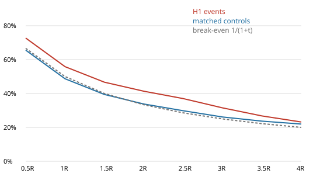
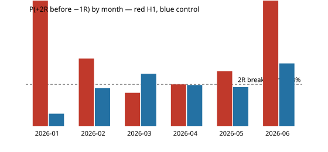

# Gold V1 — H3 event study (COMPRESSION → DISPLACEMENT → ACCEPTANCE)

- **Data:** development data only, 2025-12-23 → 2026-06-02 (Exness XAUUSDm M15, bid). Validation and final OOS were not loaded.
- **Event span:** 2026-01-22 → 2026-06-02. The compression percentile needs 20 trading days of
  history, so no event can occur before late January.
- **Rules:** implemented exactly as frozen in [preregistration.md](preregistration.md) (SHA-256 c481f8a1…, frozen
  before any H3 code ran).
- **Data quality gate: PASS.** All 12 H1 checks were rerun, plus 2 H3 checks; see [data_quality.md](data_quality.md).

## Counts

| stage | long | short | total |
|---|---|---|---|
| raw compression structures (runs of compressed bars) | — | — | 293 |
| raw displacement bars (range ≥ 1.5 ATR, body ≥ 0.6; any context) | — | — | 708 |
| candidate displacements (live, intact box; close beyond it) | 46 | 54 | 100 |
| acceptance failed (next bar closed back inside) | 11 | 9 | 20 |
| accepted breakouts | 35 | 45 | 80 |
| **final unique H3 events** | 33 | 44 | **77** |

- **Dropped between accepted breakouts and final events:** duplicate suppression 2; no
  entry bar in the session 1; risk ≤ 0 0.
- **Candidates that traded through both sides of the box:** 4. Among the final events
  3 are flagged `two_sided` (kept, and reported separately below).
- **By month:** 2026-01 2, 2026-02 14, 2026-03 16, 2026-04 27, 2026-05 16, 2026-06 2. Full months (Feb–May): mean 18.2, median
  16.0 per month, about 0.8 per trading day; the design's guide was 0.3–0.6 per day.
- **By session:** Asia 35, London 22, Overlap 15, New York 4, Other 1.
- **Acceptance shape:** wick_inside 29, stalls 24, continues 24.
- **Risk** (entry − opposite side of the displacement bar):
  - in USD: median 14.67, IQR 11.25–20.23, max 53.66;
  - in ATR units: median 1.58, IQR 1.26–2.07.
- **Spread / risk:** median 1.92%, 90th percentile 3.06%, max
  5.48% (spread semantics unresolved; indicative only).
- **AMBIGUOUS_INTRABAR** (a target and −1R in one bar, any target): 2 events, 10 controls. The affected
  target is excluded from the P(...) figures. Events without a +2R/−1R resolution in 96 bars: 2.

## Primary analysis — events vs matched controls

- **Controls:** 385 bars, 5 per event, fixed seed 20260603.
- **Matching:** the same session, the same volatility regime and an ATR percentile within ±10 of the event's. The ATR
  condition was relaxed for 0 controls.
- **Exclusions:** not an H3 acceptance bar, and more than 8 bars from any event.
- **Direction and stop:** each control takes the event's direction and its risk in ATR units.
- **No H3 requirement:** controls need not have compression, displacement or acceptance.

P(+tR before −1R), Wilson 95% CI in brackets. The lift CI comes from an event-clustered bootstrap (5,000 samples).

| target | H3 events | controls | lift (pp) | lift 95% CI | break-even |
|---|---|---|---|---|---|
| +1R | 55.8% (44.7%–66.4%, n=77) | 48.7% (43.7%–53.7%, n=378) | +7.2 | -4.1 … +19.1 | 50.0% |
| +2R | 41.3% (30.9%–52.6%, n=75) | 33.8% (29.2%–38.7%, n=376) | +7.6 | -4.8 … +21.1 | 33.3% |
| +3R | 31.5% (22.0%–42.9%, n=73) | 26.1% (21.9%–30.8%, n=371) | +5.4 | -5.6 … +17.3 | 25.0% |
| +4R | 23.2% (14.8%–34.4%, n=69) | 22.0% (18.0%–26.5%, n=364) | +1.2 | -8.9 … +11.9 | 20.0% |

### MFE / MAE (R)

| sample | bars | MFE median | MFE mean | MAE median | MAE mean |
|---|---|---|---|---|---|
| H3 events | 4 | 0.67 | 0.82 | 0.54 | 0.82 |
| H3 events | 8 | 0.90 | 1.17 | 0.80 | 1.12 |
| H3 events | 16 | 1.19 | 1.71 | 1.10 | 1.72 |
| H3 events | 32 | 1.93 | 2.65 | 1.36 | 2.65 |
| H3 events | until −1R | 1.29 | 2.48 | — | — |
| controls | 4 | 0.49 | 0.73 | 0.52 | 0.81 |
| controls | 8 | 0.63 | 1.06 | 0.76 | 1.08 |
| controls | 16 | 1.02 | 1.57 | 1.05 | 1.49 |
| controls | 32 | 1.57 | 2.37 | 1.53 | 2.15 |
| controls | until −1R | 0.93 | 2.46 | — | — |

### Breakdown — H3 events

| group | n | P(+1R) | P(+2R) | P(+3R) | P(+4R) | amb | MFE32 med | MFE32 mean | MAE32 med | MAE32 mean | MFE→stop med |
|---|---|---|---|---|---|---|---|---|---|---|---|
| ALL | 77 | 55.8% | 41.3% | 31.5% | 23.2% | 2 | 1.93 | 2.65 | 1.36 | 2.65 | 1.29 |
| long | 33 | 42.4% | 33.3% | 21.9% | 13.3% | 2 | 1.53 | 2.19 | 1.77 | 3.49 | 0.92 |
| short | 44 | 65.9% | 47.6% | 39.0% | 30.8% | 0 | 2.17 | 3.00 | 1.22 | 2.03 | 1.75 |
| two-sided (flagged) | 3 | 66.7% | 33.3% | 33.3% | 0.0% | 0 | 2.28 | 2.06 | 0.63 | 0.67 | 1.33 |
| one-sided | 74 | 55.4% | 41.7% | 31.4% | 24.2% | 2 | 1.90 | 2.68 | 1.39 | 2.73 | 1.28 |
| London | 22 | 31.8% | 22.7% | 9.5% | 0.0% | 0 | 1.73 | 2.49 | 1.68 | 2.99 | 0.61 |
| New York | 4 | 75.0% | 75.0% | 50.0% | 0.0% | 0 | 2.54 | 2.56 | 1.73 | 1.47 | 2.76 |
| Overlap | 15 | 53.3% | 33.3% | 28.6% | 23.1% | 1 | 1.82 | 3.43 | 1.68 | 3.21 | 1.44 |
| Asia | 35 | 68.6% | 51.5% | 42.4% | 39.4% | 1 | 2.10 | 2.42 | 0.92 | 2.37 | 1.91 |
| Other | 1 | 100.0% | 100.0% | 100.0% | 0.0% | 0 | 3.20 | 3.20 | 1.36 | 1.36 | 3.20 |

### Breakdown — matched controls

| group | n | P(+1R) | P(+2R) | P(+3R) | P(+4R) | amb | MFE32 med | MFE32 mean | MAE32 med | MAE32 mean | MFE→stop med |
|---|---|---|---|---|---|---|---|---|---|---|---|
| ALL | 385 | 48.7% | 33.8% | 26.1% | 22.0% | 10 | 1.57 | 2.37 | 1.53 | 2.15 | 0.93 |
| long | 165 | 39.4% | 25.5% | 16.8% | 13.7% | 6 | 1.18 | 1.98 | 1.80 | 2.53 | 0.71 |
| short | 220 | 55.5% | 40.0% | 33.3% | 28.6% | 4 | 1.88 | 2.66 | 1.21 | 1.86 | 1.35 |
| two-sided (flagged) | 15 | 40.0% | 21.4% | 15.4% | 15.4% | 0 | 0.49 | 1.45 | 1.05 | 1.82 | 0.77 |
| one-sided | 370 | 49.0% | 34.3% | 26.5% | 22.2% | 10 | 1.66 | 2.41 | 1.55 | 2.16 | 0.98 |
| London | 110 | 50.0% | 36.4% | 33.6% | 27.8% | 0 | 2.25 | 2.88 | 1.53 | 2.27 | 0.99 |
| New York | 20 | 55.0% | 20.0% | 15.0% | 10.0% | 0 | 1.50 | 2.32 | 1.71 | 2.09 | 1.25 |
| Overlap | 75 | 48.6% | 31.4% | 22.9% | 21.4% | 5 | 1.60 | 2.20 | 1.59 | 2.12 | 0.98 |
| Asia | 175 | 48.6% | 35.7% | 24.7% | 20.5% | 5 | 1.35 | 2.17 | 1.37 | 2.10 | 0.93 |
| Other | 5 | 0.0% | 0.0% | 0.0% | 0.0% | 0 | 0.92 | 0.88 | 1.99 | 1.66 | 0.09 |

## Time stability

| month | events | +1R | +2R | +3R | MFE32 med | MAE32 med | control +2R | +2R diff (pp) |
|---|---|---|---|---|---|---|---|---|
| 2026-01 | 2 | 100.0% | 100.0% | 100.0% | 2.20 | 0.89 | 10.0% | 90.0 |
| 2026-02 | 14 | 64.3% | 53.8% | 16.7% | 1.78 | 1.35 | 30.3% | 23.5 |
| 2026-03 | 16 | 43.8% | 26.7% | 14.3% | 1.27 | 2.50 | 41.8% | -15.1 |
| 2026-04 | 27 | 44.4% | 33.3% | 29.6% | 2.62 | 1.38 | 32.8% | 0.5 |
| 2026-05 | 16 | 68.8% | 43.8% | 43.8% | 1.99 | 0.95 | 31.2% | 12.6 |
| 2026-06 | 2 | 100.0% | 100.0% | 100.0% | 3.59 | 0.57 | 50.0% | 50.0 |

Months with event > control at +2R: 5 of 6. January and June hold 2 events each.

| slice | lift +2R (pp) | lift +3R (pp) |
|---|---|---|
| long | 7.9 | 5.1 |
| short | 7.6 | 5.7 |

## Context features (recorded, not filtered)

| context | n | P(+2R) | MFE32 med | MAE32 med |
|---|---|---|---|---|
| acceptance_shape = continues | 24 | 45.5% | 1.20 | 1.03 |
| acceptance_shape = stalls | 24 | 45.8% | 2.16 | 2.20 |
| acceptance_shape = wick_inside | 29 | 34.5% | 2.62 | 1.27 |
| vol_regime = high | 4 | 50.0% | 1.19 | 1.32 |
| vol_regime = low | 49 | 45.8% | 2.36 | 1.25 |
| vol_regime = mid | 24 | 30.4% | 1.56 | 1.59 |
| regime = neutral | 33 | 31.2% | 1.34 | 1.85 |
| regime = range | 27 | 42.3% | 1.94 | 1.21 |
| regime = trend | 17 | 58.8% | 2.36 | 1.12 |
| toward_tvwap = False | 37 | 36.1% | 1.94 | 1.21 |
| toward_tvwap = True | 40 | 46.2% | 1.89 | 1.94 |
| session = Asia | 35 | 51.5% | 2.10 | 0.92 |
| session = London | 22 | 22.7% | 1.73 | 1.68 |
| session = New York | 4 | 75.0% | 2.54 | 1.73 |
| session = Other | 1 | 100.0% | 3.20 | 1.36 |
| session = Overlap | 15 | 33.3% | 1.82 | 1.68 |
| box_width_atr tercile low (1.14–1.8) | 26 | 38.5% | 1.70 | 1.78 |
| box_width_atr tercile mid (1.83–2.21) | 25 | 44.0% | 2.16 | 1.12 |
| box_width_atr tercile high (2.21–3.42) | 26 | 41.7% | 1.88 | 1.32 |
| compression_pct tercile low (0.0535–6.58) | 26 | 42.3% | 2.22 | 1.22 |
| compression_pct tercile mid (7.06–14.8) | 25 | 39.1% | 1.65 | 1.68 |
| compression_pct tercile high (15–20) | 26 | 42.3% | 1.90 | 1.58 |
| compression_duration tercile low (1–3) | 26 | 34.6% | 1.53 | 1.78 |
| compression_duration tercile mid (4–7) | 25 | 41.7% | 2.18 | 1.25 |
| compression_duration tercile high (7–24) | 26 | 48.0% | 2.32 | 1.20 |
| bars_since_expansion tercile low (1–15) | 26 | 34.6% | 2.23 | 1.23 |
| bars_since_expansion tercile mid (15–26) | 25 | 50.0% | 2.36 | 1.38 |
| bars_since_expansion tercile high (26–83) | 26 | 40.0% | 1.38 | 1.34 |
| disp_range_atr tercile low (1.51–1.76) | 26 | 52.0% | 2.18 | 1.58 |
| disp_range_atr tercile mid (1.78–2.18) | 25 | 40.0% | 2.16 | 1.38 |
| disp_range_atr tercile high (2.21–4.74) | 26 | 32.0% | 1.47 | 1.22 |
| disp_body_range tercile low (0.601–0.753) | 26 | 38.5% | 2.16 | 2.08 |
| disp_body_range tercile mid (0.761–0.845) | 25 | 40.0% | 2.10 | 1.80 |
| disp_body_range tercile high (0.845–0.993) | 26 | 45.8% | 1.38 | 1.12 |
| disp_close_location tercile low (0.622–0.841) | 26 | 42.3% | 1.93 | 1.98 |
| disp_close_location tercile mid (0.854–0.936) | 25 | 40.0% | 2.36 | 1.38 |
| disp_close_location tercile high (0.939–1) | 26 | 41.7% | 1.38 | 1.15 |
| dist_beyond_atr tercile low (0.0403–0.464) | 26 | 42.3% | 2.42 | 1.19 |
| dist_beyond_atr tercile mid (0.481–1.01) | 25 | 41.7% | 1.75 | 1.77 |
| dist_beyond_atr tercile high (1.08–3.74) | 26 | 40.0% | 1.68 | 1.24 |
| disp_tv_ratio tercile low (0.504–1) | 26 | 38.5% | 1.54 | 1.71 |
| disp_tv_ratio tercile mid (1.01–1.34) | 25 | 41.7% | 2.28 | 1.38 |
| disp_tv_ratio tercile high (1.37–5.75) | 26 | 44.0% | 1.98 | 1.26 |
| er_h1 tercile low (0.00155–0.127) | 26 | 40.0% | 1.93 | 1.22 |
| er_h1 tercile mid (0.133–0.255) | 25 | 29.2% | 1.33 | 2.07 |
| er_h1 tercile high (0.258–0.635) | 26 | 53.8% | 2.27 | 1.20 |
| atr_pct tercile low (1.02–13.5) | 26 | 36.0% | 1.99 | 1.34 |
| atr_pct tercile mid (13.9–30.9) | 25 | 56.0% | 2.36 | 1.21 |
| atr_pct tercile high (31.5–86.6) | 26 | 32.0% | 1.48 | 1.58 |
| tvwap_dist_atr tercile low (-4.3–-0.802) | 26 | 44.0% | 2.17 | 1.20 |
| tvwap_dist_atr tercile mid (-0.795–1.01) | 25 | 41.7% | 2.10 | 2.17 |
| tvwap_dist_atr tercile high (1.23–5.26) | 26 | 38.5% | 1.64 | 1.47 |
| tvwap_slope tercile low (-0.785–-0.0559) | 26 | 44.0% | 2.23 | 1.17 |
| tvwap_slope tercile mid (-0.0547–0.128) | 25 | 36.0% | 1.93 | 2.17 |
| tvwap_slope tercile high (0.136–0.607) | 26 | 44.0% | 1.64 | 1.18 |
| tv_ratio tercile low (0.459–0.961) | 26 | 26.9% | 1.76 | 2.15 |
| tv_ratio tercile mid (0.964–1.27) | 25 | 48.0% | 2.18 | 1.19 |
| tv_ratio tercile high (1.28–3.75) | 26 | 50.0% | 1.73 | 1.13 |
| spread_risk tercile low (0.00298–0.0147) | 26 | 50.0% | 1.25 | 1.12 |
| spread_risk tercile mid (0.0154–0.0229) | 25 | 36.0% | 2.10 | 1.25 |
| spread_risk tercile high (0.0233–0.0548) | 26 | 38.5% | 3.04 | 2.15 |
| risk_atr tercile low (0.493–1.43) | 26 | 30.8% | 2.56 | 2.52 |
| risk_atr tercile mid (1.44–1.74) | 25 | 48.0% | 2.10 | 1.21 |
| risk_atr tercile high (1.77–5.21) | 26 | 45.8% | 1.31 | 1.08 |
| pdh_dist_atr tercile low (-8.7–4.21) | 26 | 40.0% | 1.84 | 1.67 |
| pdh_dist_atr tercile mid (4.32–6.5) | 25 | 48.0% | 2.28 | 1.21 |
| pdh_dist_atr tercile high (6.51–14.5) | 26 | 36.0% | 1.70 | 1.24 |
| pdl_dist_atr tercile low (-4.91–4.26) | 26 | 36.0% | 2.50 | 1.22 |
| pdl_dist_atr tercile mid (4.68–7.3) | 25 | 41.7% | 1.75 | 1.25 |
| pdl_dist_atr tercile high (7.51–20.9) | 26 | 46.2% | 1.68 | 1.47 |

Tercile cells hold about 25 events each; a Wilson half-width at n = 25 is about ±18 pp. These rows are for the
feature library only.

## Statistical power

With 75 resolved events at +2R and a control rate of 33.8%, the smallest lift this sample could detect
(95% two-sided, 80% power) is about **±17 pp**. The rule is applied unchanged; this note only says how much
the verdict can and cannot say.

## Decision: **WEAK**

The rule is the H1/H2 one, unchanged, with the preregistered slices long and short:
- **PROMISING** requires all of: a +2R lift ≥ 5 pp with the 95% CI above 0; event > control in at least 4 of 6 months; a positive +2R lift in both slices.
- **WEAK**: a positive lift at +2R or +3R that fails those tests.
- **NO EDGE**: no positive lift at +2R or +3R.

Observed:
- +2R lift +7.6 pp (CI -4.8 … +21.1);
- +3R lift +5.4 pp (CI -5.6 … +17.3);
- 5/6 months positive;
- slice lifts at +2R: long 7.9, short 7.6.

WEAK because the +2R lift is positive and passes the size, month and slice tests, but its 95% CI includes zero.

## Interpretation — where the lift is and where it disappears

- **Direction of the effect.** Confirmed breakouts from compression continued slightly better than comparable M15
  bars. The point estimates are positive from +1R to +4R. The lift is similar for long (7.9 pp) and
  short (7.6 pp), even though longs and shorts have very different base rates in this period (the
  controls show the same long/short gap). So the lift is not simply the period's directional drift.
- **It is not established.** Every bootstrap CI crosses zero. The sample can only detect lifts of about
  ±17 pp, and the observed +7.6 pp is well inside the noise band.
- **It fades with target distance.** The lift is +7.2 / +7.6 / +5.4 / +1.2 pp at
  +1R to +4R, and is essentially gone at +4R. Median MFE is higher than the controls' at every horizon (4 to 32 bars). Mean MAE at 32
  bars is *higher* than the controls' (2.65R vs 2.15R): the adverse tail is fatter, even
  though the median is lower. This looks like a short follow-through, not a larger move.
- **It is uneven over time.** Of the four full months, February (+23.5 pp) and May (+12.6 pp) are positive, April is
  flat (+0.5 pp) and March is negative (−15.1 pp). The 5-of-6 month count relies on January and June, which hold 2
  events each. Without the two stub months the lift would rest on two months.
- **Session cells look different but are post-hoc.** Asia events outperform their controls; London events
  underperform theirs. These cells hold 22–35 events. They were not preregistered and are **not** candidate
  filters. The same goes for the context terciles.
- **Economics are not tested here.** The event P(+2R) of 41.3% is above the 33.3% break-even, but the
  control is at break-even too (33.8%). A gross +2R race implies about +0.24R per event before costs;
  median spread/risk is 1.9% of R. That is neither a strategy result nor evidence of one.
- **No rescue.** Per the brief, H3 is not rescued or refined with filters. Validation and OOS were not inspected.
  H4/H5 wait for review.
