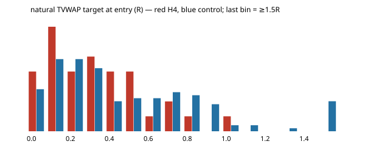
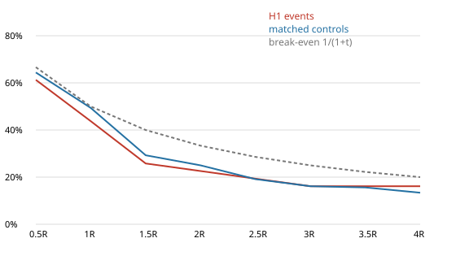
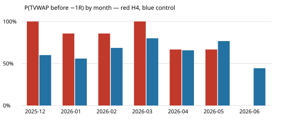

# Gold V1 — H4 event study (TVWAP BAND EXHAUSTION FADE)

- **Data:** development data only, 2025-12-23 → 2026-06-02 (Exness XAUUSDm M15, bid). Validation and final OOS were not loaded.
- **Event span:** 2025-12-24 → 2026-06-02.
- **Rules:** implemented exactly as frozen in [preregistration.md](preregistration.md) (SHA-256 92f25167…, frozen before any H4
  code ran).
- **Signal:** range regime (H1 ER ≤ 0.15), a close strictly outside TVWAP ± 2σ, then a close strictly inside ± 1σ
  within 2 bars. The New York open hour is excluded. Entry at the next open; stop at the extreme of the exhaustion
  streak through the reentry bar, with no buffer.
- **Primary target:** the live causal TVWAP. During each bar the level is TVWAP at the previous close.
- **Data quality gate: PASS.** All 12 H1 checks were rerun, plus 2 H4 checks; see [data_quality.md](data_quality.md).

## Counts

| stage | long (lower band) | short (upper band) | total |
|---|---|---|---|
| raw closes outside ±2σ (all bars) | 466 | 698 | 1164 |
| eligible outside closes (≥ 5th session bar) | 372 | 585 | 957 |
| exhaustion streaks | 285 | 330 | 615 |
| expired without reentry in 2 bars | 120 | 159 | 279 |
| cancelled by an opposite-side 2σ close | 4 | 6 | 10 |
| reentries inside ±1σ within 2 bars | 58 | 46 | 104 |
| excluded: not range regime at the reentry | 32 | 30 | 62 |
| excluded: New York open hour (design) | 2 | 2 | 4 |
| **unique H4 events** | 22 | 11 | **33** |

- **Rejected:** risk ≤ 0 0; no natural target (entry at or beyond TVWAP, target_R ≤ 0)
  5; no entry bar 0.
- **By month:** 2025-12 2, 2026-01 7, 2026-02 8, 2026-03 1, 2026-04 7, 2026-05 6, 2026-06 2. Full months (Jan–May): mean 5.8, median
  7 per month, about 0.3 per trading day (the design's guide: 0.3–0.8 per day).
- **By session:** Asia 22, Other 3, Overlap 3, London 3, New York 2.
- **Risk:**
  - in USD: median 15.08, IQR 10.19–18.28, max 76.30;
  - in ATR units: median 1.50, IQR 1.14–1.99.
- **Primary outcomes:** events hit 23, stop 7, session_end 3; controls hit 103, stop 55, session_end 5, ambiguous 1.
- **AMBIGUOUS_INTRABAR:** 0 events in the primary race and 1 events at some standard R target.
  They are excluded from the P(...) figures and counted as −1R in the expectancy.

## Natural TVWAP target (critical)

| | H4 events | controls |
|---|---|---|
| target R at entry — median | **0.36R** | 0.40R |
| target R at entry — mean | 0.36R | 0.56R |
| target R — IQR | 0.16–0.57R | 0.21–0.76R |
| share of events with target ≥ 1R | 3% | 9% |
| realized R when TVWAP is hit — median | 0.22R | 0.25R |
| realized R when TVWAP is hit — mean | 0.30R | 0.34R |
| time to TVWAP (hits) — median | 1 bars / 15 min | 2 bars / 30 min |
| time to TVWAP (hits) — mean | 3.2 bars / 48 min | 3.5 bars / 53 min |

The design expected TVWAP to sit about 1–1.5R away. With a structural stop at the exhaustion extreme, it sits about
0.36R away. The target is live and usually moves toward the entry, so realized R at a hit is similar
to or smaller than the target at entry.

## Primary analysis — P(TVWAP before −1R)

- **Controls:** 164 draws, deterministic (seed 20260603), 5 per event.
- **Matching:** range-regime bars (ER ≤ 0.15) in the same session, with an ATR percentile within ±10, TVWAP on the
  trade's target side, and a TVWAP distance within ±0.25 ATR of the event's.
- **Exclusions:** no H4 reentry bars, not the New York open hour, at least the 5th bar of the session, and more than 8
  bars from any event.
- **Direction and stop:** each control takes the event's direction and its risk in ATR units.
- **Relaxations:** the distance condition was relaxed for 10 events and the ATR condition for
  9. 1 control draw was discarded for target_R ≤ 0. Only 127 unique control bars were drawn.

| outcome | H4 events | controls | lift (pp) | lift 95% CI (event-clustered bootstrap) |
|---|---|---|---|---|
| **P(TVWAP before −1R)** | 76.7% (59.1%–88.2%, n=30) | 65.2% (57.5%–72.2%, n=158) | **+11.5** | -6.4 … +27.8 |
| conservative (ambiguous = stop) | 76.7% | 64.8% | +11.9 | — |

### Economics (indicative; spread semantics unresolved)

| | H4 events | controls |
|---|---|---|
| spread as % of 1R — median | 1.63% | 1.74% |
| spread as % of the natural TVWAP target — median | 5.8% | 4.7% |
| spread as % of the natural TVWAP target — mean | 38.2% | 8.8% |
| expectancy per trade, gross (R) | -0.030 | -0.114 |
| expectancy per trade, after mean spread/risk (R) | **-0.048** | -0.133 |

Expectancy is the mean outcome R over all events: realized R at a TVWAP hit, −1 at the stop, −1 when ambiguous, and
mark-to-market at the session end.

## Standard R study (comparability only; not the H4 criterion)

| target | H4 events | controls | lift (pp) | lift 95% CI | break-even |
|---|---|---|---|---|---|
| +1R | 43.8% (28.2%–60.7%, n=32) | 49.4% (41.8%–57.0%, n=164) | -5.6 | -24.3 … +14.4 | 50.0% |
| +2R | 22.6% (11.4%–39.8%, n=31) | 25.0% (19.0%–32.1%, n=164) | -2.4 | -19.4 … +15.9 | 33.3% |
| +3R | 16.1% (7.1%–32.6%, n=31) | 16.1% (11.3%–22.6%, n=161) | -0.0 | -13.2 … +14.9 | 25.0% |
| +4R | 16.1% (7.1%–32.6%, n=31) | 13.4% (8.9%–19.6%, n=157) | +2.8 | -10.0 … +16.9 | 20.0% |

| sample | bars | MFE median | MFE mean | MAE median | MAE mean |
|---|---|---|---|---|---|
| H4 events | 4 | 0.50 | 0.85 | 0.45 | 0.57 |
| H4 events | 8 | 0.73 | 1.33 | 0.57 | 0.93 |
| H4 events | 16 | 1.09 | 1.83 | 0.69 | 1.19 |
| H4 events | 32 | 1.26 | 2.19 | 1.31 | 1.85 |
| controls | 4 | 0.47 | 0.65 | 0.65 | 0.89 |
| controls | 8 | 0.77 | 0.95 | 0.90 | 1.17 |
| controls | 16 | 1.03 | 1.22 | 1.24 | 1.49 |
| controls | 32 | 1.16 | 1.87 | 1.90 | 2.33 |

### Breakdown — H4 events (standard R)

| group | n | P(+1R) | P(+2R) | P(+3R) | P(+4R) | amb | MFE32 med | MFE32 mean | MAE32 med | MAE32 mean | MFE→stop med |
|---|---|---|---|---|---|---|---|---|---|---|---|
| ALL | 33 | 43.8% | 22.6% | 16.1% | 16.1% | 1 | 1.26 | 2.19 | 1.31 | 1.85 | 0.69 |
| long (lower band) | 22 | 42.9% | 20.0% | 20.0% | 20.0% | 0 | 1.25 | 2.14 | 1.14 | 1.74 | 0.65 |
| short (upper band) | 11 | 45.5% | 27.3% | 9.1% | 9.1% | 1 | 1.47 | 2.28 | 1.42 | 2.08 | 0.84 |
| Asia | 22 | 36.4% | 18.2% | 13.6% | 13.6% | 1 | 1.23 | 1.79 | 1.37 | 2.02 | 0.68 |
| London | 3 | 66.7% | 33.3% | 0.0% | 0.0% | 0 | 1.41 | 1.52 | 2.33 | 1.99 | 1.41 |
| Overlap | 3 | 66.7% | 33.3% | 33.3% | 33.3% | 0 | 1.25 | 3.87 | 0.75 | 1.66 | 1.25 |
| New York | 2 | 50.0% | 0.0% | 0.0% | 0.0% | 0 | 0.37 | 0.37 | 0.84 | 0.84 | 0.67 |
| Other | 3 | 50.0% | 50.0% | 50.0% | 50.0% | 0 | 6.92 | 6.92 | 1.09 | 1.09 | 0.20 |

## Monthly stability

| month | events | P(TVWAP first) | control | diff (pp) | median target R | +1R | +2R | MFE32 med | MAE32 med |
|---|---|---|---|---|---|---|---|---|---|
| 2025-12 | 2 | 100.0% | 60.0% | 40.0 | 0.35 | 0.0% | 0.0% | 0.65 | 0.54 |
| 2026-01 | 7 | 85.7% | 55.9% | 29.8 | 0.25 | 57.1% | 28.6% | 1.62 | 1.27 |
| 2026-02 | 8 | 85.7% | 68.6% | 17.1 | 0.30 | 62.5% | 28.6% | 1.34 | 1.21 |
| 2026-03 | 1 | 100.0% | 80.0% | 20.0 | 0.00 | 0.0% | 0.0% | 2.22 | 1.42 |
| 2026-04 | 7 | 66.7% | 65.7% | 1.0 | 0.57 | 42.9% | 42.9% | 2.20 | 0.75 |
| 2026-05 | 6 | 66.7% | 76.7% | -10.0 | 0.35 | 33.3% | 0.0% | 1.07 | 2.89 |
| 2026-06 | 2 | 0.0% | 44.4% | -44.4 | 0.36 | 0.0% | 0.0% | 0.34 | 5.13 |

Months with event > control on the primary rate: 5 of 7; the preregistered requirement is 5 of 7.
December (from 12-23) and June (2 days) are stubs; March has a single event.

| slice | primary lift (pp) |
|---|---|
| long (lower band) | 18.8 |
| short (upper band) | -1.8 |

## Context features (recorded, not filtered)

| context | n | P(TVWAP first) | median target R | mean outcome R |
|---|---|---|---|---|
| session = Asia | 22 | 72.7% | 0.36 | -0.04 |
| session = London | 3 | 100.0% | 0.41 | 0.37 |
| session = New York | 2 | 100.0% | 0.46 | -0.14 |
| session = Other | 3 | 50.0% | 0.36 | -0.24 |
| session = Overlap | 3 | 100.0% | 0.16 | -0.07 |
| vol_regime = high | 3 | 50.0% | 0.15 | -0.42 |
| vol_regime = low | 14 | 69.2% | 0.36 | -0.11 |
| vol_regime = mid | 16 | 86.7% | 0.35 | 0.11 |
| expansion_before = False | 16 | 64.3% | 0.42 | -0.15 |
| expansion_before = True | 17 | 87.5% | 0.35 | 0.09 |
| reentry_delay = 1 | 20 | 73.7% | 0.35 | -0.08 |
| reentry_delay = 2 | 13 | 81.8% | 0.36 | 0.05 |
| dow = Friday | 9 | 88.9% | 0.16 | 0.05 |
| dow = Monday | 4 | 50.0% | 0.40 | -0.17 |
| dow = Sunday | 1 | 0.0% | 0.62 | -1.00 |
| dow = Thursday | 9 | 71.4% | 0.25 | -0.16 |
| dow = Tuesday | 6 | 100.0% | 0.39 | 0.30 |
| dow = Wednesday | 4 | 75.0% | 0.57 | -0.04 |
| exh_dist_sigma tercile low (0.016–0.0936) | 11 | 88.9% | 0.29 | 0.11 |
| exh_dist_sigma tercile mid (0.119–0.309) | 11 | 70.0% | 0.42 | -0.15 |
| exh_dist_sigma tercile high (0.326–1.3) | 11 | 72.7% | 0.36 | -0.05 |
| exh_dist_atr tercile low (0.00956–0.08) | 11 | 88.9% | 0.25 | 0.07 |
| exh_dist_atr tercile mid (0.0889–0.206) | 11 | 63.6% | 0.38 | -0.18 |
| exh_dist_atr tercile high (0.211–1.2) | 11 | 80.0% | 0.37 | 0.03 |
| tvwap_slope tercile low (-1.74–-0.304) | 11 | 77.8% | 0.58 | 0.08 |
| tvwap_slope tercile mid (-0.263–-0.0915) | 11 | 80.0% | 0.21 | -0.06 |
| tvwap_slope tercile high (0.0611–1.14) | 11 | 72.7% | 0.14 | -0.10 |
| sigma_atr tercile low (0.425–0.686) | 11 | 63.6% | 0.14 | -0.27 |
| sigma_atr tercile mid (0.7–0.907) | 11 | 72.7% | 0.36 | -0.06 |
| sigma_atr tercile high (0.939–2.21) | 11 | 100.0% | 0.57 | 0.24 |
| er_h1 tercile low (0.00127–0.0451) | 11 | 90.0% | 0.21 | 0.08 |
| er_h1 tercile mid (0.0475–0.101) | 11 | 60.0% | 0.38 | -0.21 |
| er_h1 tercile high (0.102–0.149) | 11 | 80.0% | 0.37 | 0.04 |
| atr_pct tercile low (0.595–21.3) | 8 | 71.4% | 0.25 | -0.17 |
| atr_pct tercile mid (23.4–31.4) | 8 | 71.4% | 0.38 | -0.06 |
| atr_pct tercile high (40.7–79.3) | 8 | 71.4% | 0.43 | -0.00 |
| tv_ratio tercile low (0.549–0.966) | 11 | 81.8% | 0.36 | 0.03 |
| tv_ratio tercile mid (0.987–1.33) | 11 | 70.0% | 0.21 | -0.16 |
| tv_ratio tercile high (1.59–5.5) | 11 | 77.8% | 0.46 | 0.03 |
| target_r tercile low (0.00291–0.178) | 11 | 90.9% | 0.13 | 0.01 |
| target_r tercile mid (0.209–0.421) | 11 | 77.8% | 0.36 | -0.03 |
| target_r tercile high (0.431–1.03) | 11 | 60.0% | 0.58 | -0.07 |
| spread_risk tercile low (0.0021–0.0131) | 11 | 88.9% | 0.21 | -0.01 |
| spread_risk tercile mid (0.0132–0.0212) | 11 | 81.8% | 0.36 | 0.07 |
| spread_risk tercile high (0.0214–0.0531) | 11 | 60.0% | 0.38 | -0.15 |
| prior_touches_session tercile low (0–1) | 11 | 72.7% | 0.38 | 0.03 |
| prior_touches_session tercile mid (1–2) | 11 | 70.0% | 0.29 | -0.15 |
| prior_touches_session tercile high (2–5) | 11 | 88.9% | 0.35 | 0.03 |

Tercile cells hold 11 events each, so they are noise at this sample size. They are for the feature library only.

## Statistical power

With 30 resolved events and a control rate of 65.2%, the smallest primary lift this sample could detect
(95% two-sided, 80% power) is about **±27 pp**.

## Decision: **WEAK**

The preregistered H4 rule, unchanged:

| test | result |
|---|---|
| 1. primary lift ≥ 5 pp and 95% CI above 0 | FAIL: +11.5 pp (CI -6.4 … +27.8) |
| 2a. event > control in ≥ 5 of 7 months | PASS: 5 of 7 |
| 2b. positive lift in both slices | FAIL: long (lower band) 18.8, short (upper band) -1.8 |
| 3. uncertainty (covered by test 1's CI) | FAIL |
| 4. expectancy after spread > 0 | FAIL: -0.048 R per trade |

PROMISING needs all of these. WEAK means a positive primary lift that fails any test. NO EDGE means a primary lift ≤ 0.

## Interpretation — where the effect is and where it disappears

- **Mean reversion looks real in direction, not in significance.** After a ±2σ exhaustion and a ±1σ reentry, price
  reached TVWAP before the stop more often than comparable range-regime bars (76.7% vs
  65.2%). But with 33 events the CI runs from -6.4 to +27.8 pp, and the sample could only detect
  about ±27 pp.
- **The lift is one-sided.** Lower-band fades (long, 22 events) carry it (18.8 pp). Upper-band fades
  (short, 11 events) do not (-1.8 pp). Development gold was flat end to end (4466 → 4474), but it
  rallied from December to February and declined from March to May. The months where H4 beats its controls are
  the rally months, so regime drift may be part of the long-side number. That is not tested here, and it is **not** a
  reason to keep long-only fades.
- **It fades over time.** December to March are positive, April is flat (+1.0), and May (−10.0) and June (−44.4) are
  negative. The 5-of-7 month pass relies on December (2 events) and March (1 event).
- **It fails on economics.** The natural target is small: median 0.36R at entry, 0.22R realized at a
  median hit, and only 3% of events had a target of 1R or more. So a ~77% hit rate still gives a
  negative expectancy: -0.030R gross and -0.048R after the indicative spread. The median spread is 1.6% of
  1R but 5.8% of the natural target. The mean (38%) is dominated by one event with a 0.003R target. The design's
  "≈ 1–1.5R" TVWAP distance does not hold with a structural stop at the exhaustion extreme.
- **The controls lose too** (-0.114R gross). A fade toward TVWAP in the range regime is not a positive-expectancy
  baseline on this data at these stop sizes. H4 improves the hit rate but not enough to pay for a target a third of
  the risk.
- **No rescue.** Per the brief, H4 is not rescued with side, session, σ-distance, TVWAP-slope, volatility, volume or
  time filters. Validation and OOS were not inspected. The consolidated H1–H5 comparison is deferred until H4 has
  been reviewed, as instructed.
