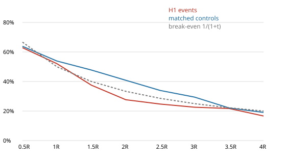
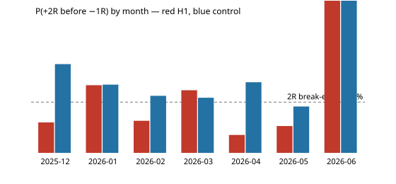

# Gold V1 — H5 event study (NEW YORK OPENING-RANGE ACCEPTANCE)

- **Data:** development data only, 2025-12-23 → 2026-06-02 (Exness XAUUSDm M15, bid). Validation and final OOS were not loaded.
- **Event span:** 2025-12-23 → 2026-06-02.
- **Rules:** implemented exactly as frozen in [preregistration.md](preregistration.md) (SHA-256 cfeda52f…, frozen before any H5
  code ran).
- **Opening range:** the 09:30 and 09:45 New York bars, located by wall-clock time. That is 14:30/14:45 UTC under EST
  (52 days) and 13:30/13:45 UTC under EDT (61 days).
- **Signal and stop:** confirmation by two consecutive closes strictly beyond the OR, at the 10:15–12:45 New York bars. Entry
  at the next open; stop at the OR midpoint.
- **Data quality gate: PASS.** All 12 H1 checks were rerun, plus 3 H5 checks; see [data_quality.md](data_quality.md).

## Counts

| stage | long | short | total |
|---|---|---|---|
| days studied / days with an OR | — | — | 114 / 113 |
| raw outside closes (10:00–12:45 New York bars) | 425 | 363 | 788 |
| two-close confirmations (incl. repeats) | 336 | 289 | 625 |
| suppressed repeats (one event per direction per day) | 283 | 244 | 527 |
| **unique H5 events** | 53 | 45 | **98** |

- **Rejected:** no entry bar 0; risk ≤ 0 0.
- **Missing OR:** the one trading day without an OR is the partial day that starts 2026-06-02 22:00 UTC, which the
  development cut truncates.
- **Day classes** (113 OR days): long only 49, short only 41, both directions 4, neither 19.
- **By month:** 2025-12 5, 2026-01 19, 2026-02 20, 2026-03 17, 2026-04 18, 2026-05 18, 2026-06 1. Full months (Jan–May): mean 18.4, median
  18 per month, about 0.87 per trading day.
- **Confirmation time (New York):** 10:15 24, 10:30 16, 10:45 11, 11:00 12, 11:15 6, 11:30 9, 11:45 6, 12:00 8, 12:15 2, 12:30 3, 12:45 1.
- **Risk** (entry − OR mid):
  - in USD: median 25.44, IQR 16.58–33.06, max 326.95;
  - in ATR units: median 1.70, IQR 1.34–2.30, max 6.44.
  - The maximum is 2026-01-29, a genuine ~400-point crash in both the M15 and H1 data. The event is kept, and R
    normalization makes it a single event.
- **Spread / risk:** median 0.98%, 90th percentile 2.10%, max
  5.41% (spread semantics unresolved; indicative only).
- **AMBIGUOUS_INTRABAR** (a target and −1R in one bar, any target): 0 events, 1 controls. The affected
  target is excluded. Events without a +2R/−1R resolution in 96 bars: 4.

## Primary analysis — events vs matched controls

- **Controls:** 490 draws, 5 per event, fixed seed 20260603.
- **Matching:** bars starting 10:15–12:45 New York on OR days, with the same volatility regime, an ATR percentile
  within ±10 of the event's, and the same OR-width tercile where practical.
- **Exclusions:** not a confirming bar, and more than 8 bars from any event.
- **Direction and stop:** each control takes the event's direction and its risk in ATR units.
- **Relaxations:** the OR-tercile condition was relaxed for 180 draws and the ATR-percentile condition for
  105.
- **Thin pool.** The ±8-bar exclusion, kept unchanged from H1–H3, removes most of the 3-hour window on event days, so
  controls come mainly from non-event days and from event days' other directions or times. Only **139 unique bars**
  stand behind the 490 draws. Repeated draws make the control rates less precise than their Wilson CIs suggest. The event-clustered
  bootstrap resamples events together with their own draws, but it does not model draws shared between events.

P(+tR before −1R), Wilson 95% CI in brackets. The lift CI comes from an event-clustered bootstrap (5,000 samples).

| target | H5 events | controls | lift (pp) | lift 95% CI | break-even |
|---|---|---|---|---|---|
| +1R | 52.1% (42.2%–61.8%, n=96) | 53.9% (49.4%–58.3%, n=477) | -1.8 | -14.6 … +10.8 | 50.0% |
| +2R | 27.7% (19.6%–37.4%, n=94) | 40.8% (36.4%–45.4%, n=458) | -13.2 | -24.5 … -2.0 | 33.3% |
| +3R | 22.6% (15.3%–32.1%, n=93) | 29.4% (25.3%–33.9%, n=435) | -6.8 | -16.9 … +3.4 | 25.0% |
| +4R | 16.7% (10.4%–25.7%, n=90) | 19.1% (15.5%–23.3%, n=388) | -2.4 | -12.2 … +7.4 | 20.0% |

### MFE / MAE (R)

| sample | bars | MFE median | MFE mean | MAE median | MAE mean |
|---|---|---|---|---|---|
| H5 events | 4 | 0.39 | 0.61 | 0.43 | 0.56 |
| H5 events | 8 | 0.50 | 0.81 | 0.56 | 0.78 |
| H5 events | 16 | 0.72 | 1.01 | 0.73 | 1.03 |
| H5 events | 32 | 1.03 | 1.74 | 1.23 | 1.71 |
| H5 events | until −1R | 1.02 | 1.85 | — | — |
| controls | 4 | 0.34 | 0.53 | 0.34 | 0.47 |
| controls | 8 | 0.44 | 0.64 | 0.45 | 0.60 |
| controls | 16 | 0.60 | 0.91 | 0.60 | 0.84 |
| controls | 32 | 1.03 | 1.74 | 0.88 | 1.55 |
| controls | until −1R | 1.22 | 2.04 | — | — |

### Breakdown — H5 events

| group | n | P(+1R) | P(+2R) | P(+3R) | P(+4R) | amb | MFE32 med | MFE32 mean | MAE32 med | MAE32 mean | MFE→stop med |
|---|---|---|---|---|---|---|---|---|---|---|---|
| ALL | 98 | 52.1% | 27.7% | 22.6% | 16.7% | 0 | 1.03 | 1.74 | 1.23 | 1.71 | 1.02 |
| long | 53 | 45.3% | 30.8% | 25.5% | 18.4% | 0 | 0.88 | 1.66 | 1.18 | 1.79 | 0.77 |
| short | 45 | 60.5% | 23.8% | 19.0% | 14.6% | 0 | 1.11 | 1.83 | 1.29 | 1.61 | 1.11 |
| both-directions day | 8 | 37.5% | 12.5% | 12.5% | 12.5% | 0 | 0.74 | 2.90 | 2.24 | 3.39 | 0.50 |
| one-direction day | 90 | 53.4% | 29.1% | 23.5% | 17.1% | 0 | 1.03 | 1.63 | 1.18 | 1.56 | 1.05 |
| confirm 10:xx | 51 | 46.0% | 29.2% | 23.4% | 17.4% | 0 | 0.82 | 1.41 | 1.17 | 1.80 | 0.85 |
| confirm 11:xx | 33 | 59.4% | 31.2% | 25.0% | 19.4% | 0 | 1.08 | 1.60 | 1.24 | 1.42 | 1.09 |
| confirm 12:xx | 14 | 57.1% | 14.3% | 14.3% | 7.7% | 0 | 1.14 | 3.21 | 1.34 | 2.02 | 1.08 |

### Breakdown — matched controls

| group | n | P(+1R) | P(+2R) | P(+3R) | P(+4R) | amb | MFE32 med | MFE32 mean | MAE32 med | MAE32 mean | MFE→stop med |
|---|---|---|---|---|---|---|---|---|---|---|---|
| ALL | 490 | 53.9% | 40.8% | 29.4% | 19.1% | 1 | 1.03 | 1.74 | 0.88 | 1.55 | 1.22 |
| long | 265 | 51.3% | 36.8% | 27.0% | 15.9% | 0 | 0.86 | 1.38 | 1.08 | 1.83 | 1.05 |
| short | 225 | 57.0% | 45.5% | 32.2% | 22.5% | 1 | 1.54 | 2.16 | 0.72 | 1.22 | 1.41 |
| both-directions day | 40 | 62.5% | 50.0% | 35.0% | 35.0% | 0 | 2.31 | 3.66 | 1.15 | 2.37 | 1.97 |
| one-direction day | 450 | 53.1% | 40.0% | 28.9% | 17.2% | 1 | 0.98 | 1.56 | 0.84 | 1.48 | 1.14 |

## Monthly stability

| month | events | +1R | +2R | +3R | MFE32 med | MAE32 med | control +2R | +2R diff (pp) |
|---|---|---|---|---|---|---|---|---|
| 2025-12 | 5 | 40.0% | 20.0% | 0.0% | 0.15 | 1.73 | 58.3% | -38.3 |
| 2026-01 | 19 | 66.7% | 44.4% | 38.9% | 2.13 | 0.86 | 44.8% | -0.4 |
| 2026-02 | 20 | 47.4% | 21.1% | 16.7% | 0.95 | 1.39 | 37.5% | -16.4 |
| 2026-03 | 17 | 58.8% | 41.2% | 41.2% | 1.11 | 0.86 | 36.2% | 4.9 |
| 2026-04 | 18 | 33.3% | 11.8% | 5.9% | 0.66 | 1.29 | 46.4% | -34.7 |
| 2026-05 | 18 | 55.6% | 17.6% | 11.8% | 1.00 | 1.19 | 30.5% | -12.8 |
| 2026-06 | 1 | 100.0% | 100.0% | 100.0% | — | — | 100.0% | 0.0 |

Months with event > control at +2R: 1 of 7. The preregistered requirement for 7 months is
5. December (from 12-23) and June (one day) are stubs.

| slice | lift +2R (pp) | lift +3R (pp) |
|---|---|---|
| long | -6.1 | -1.5 |
| short | -21.7 | -13.1 |

## Special analysis — double breaks (descriptive only, not a filter)

**Trade-through breaks** of the OR, from 10:00 New York to the end of the trading day (113 OR days):
- **Broke at least one side:** 113 days (100%). Up 82 (73%), down 78
  (69%), both 47 (42%).
- **First break:** down 56, up 52, both_same_bar 5.
- **P(opposite-side trade-through after the first break)** = 42/108 = **39%**. Days whose first bar
  broke both sides at once are excluded from this ratio.

**Close-based:** P(opposite-direction two-close confirmation | a first confirmation that day) = 4/94 =
**4%**.

**Outcomes by day type.** The day type is only known after the entry, so these rows use future information and
describe the setup; they are not a usable filter.

| group | n | P(+1R) | P(+2R) | P(+3R) | MFE32 med | MAE32 med |
|---|---|---|---|---|---|---|
| events on single-direction-confirmation days | 90 | 53.4% | 29.1% | 23.5% | 1.03 | 1.18 |
| events on both-direction-confirmation days | 8 | 37.5% | 12.5% | 12.5% | 0.74 | 2.24 |
|   of which: the first confirmation that day | 4 | 0.0% | 0.0% | 0.0% | 0.23 | 6.35 |
|   of which: the second (opposite) confirmation | 4 | 75.0% | 25.0% | 25.0% | 3.74 | 0.94 |
| events on single-side trade-through days | 60 | 54.2% | 32.8% | 26.3% | 1.09 | 1.17 |
| events on both-side trade-through days | 38 | 48.6% | 19.4% | 16.7% | 1.00 | 1.65 |

## Context features (recorded, not filtered)

| context | n | P(+2R) | MFE32 med | MAE32 med |
|---|---|---|---|---|
| first_break = both_same_bar | 6 | 33.3% | 2.40 | 1.99 |
| first_break = down | 46 | 32.6% | 1.13 | 1.17 |
| first_break = up | 46 | 22.2% | 0.83 | 1.24 |
| opposite_swept_before = False | 69 | 28.4% | 0.95 | 1.26 |
| opposite_swept_before = True | 29 | 25.9% | 1.08 | 1.00 |
| or_vs_pd = above | 27 | 26.9% | 1.52 | 1.23 |
| or_vs_pd = below | 11 | 9.1% | 0.48 | 1.18 |
| or_vs_pd = inside | 59 | 30.4% | 0.98 | 1.27 |
| or_vs_pd = na | 1 | 100.0% | 2.47 | 0.22 |
| or_vs_asia = above | 24 | 29.2% | 1.45 | 1.37 |
| or_vs_asia = below | 15 | 20.0% | 0.82 | 0.88 |
| or_vs_asia = inside | 59 | 29.1% | 0.98 | 1.27 |
| vol_regime = high | 35 | 25.0% | 1.07 | 1.04 |
| vol_regime = low | 11 | 36.4% | 0.79 | 1.86 |
| vol_regime = mid | 52 | 27.5% | 1.04 | 1.21 |
| regime = neutral | 43 | 26.8% | 0.97 | 1.26 |
| regime = range | 34 | 36.4% | 1.11 | 1.15 |
| regime = trend | 21 | 15.0% | 0.78 | 1.23 |
| dow = Friday | 23 | 34.8% | 1.20 | 1.10 |
| dow = Monday | 22 | 4.5% | 0.83 | 2.19 |
| dow = Thursday | 17 | 33.3% | 0.48 | 0.86 |
| dow = Tuesday | 17 | 62.5% | 2.11 | 0.85 |
| dow = Wednesday | 19 | 11.1% | 0.80 | 1.24 |
| us_short_session = False | 94 | 27.8% | 1.00 | 1.17 |
| us_short_session = True | 4 | 25.0% | 1.96 | 3.57 |
| or_width_atr tercile low (0.857–1.81) | 33 | 12.5% | 1.11 | 1.74 |
| or_width_atr tercile mid (1.83–2.21) | 32 | 43.3% | 1.29 | 0.81 |
| or_width_atr tercile high (2.21–3.7) | 33 | 28.1% | 0.54 | 1.17 |
| or_width_pct tercile low (0–20) | 30 | 17.2% | 1.48 | 1.65 |
| or_width_pct tercile mid (20–50) | 30 | 36.7% | 0.89 | 1.26 |
| or_width_pct tercile high (50–100) | 30 | 33.3% | 0.55 | 1.06 |
| overnight_dist_atr tercile low (-10.2–-0.889) | 33 | 19.4% | 0.56 | 1.15 |
| overnight_dist_atr tercile mid (-0.858–2.84) | 32 | 36.7% | 1.11 | 1.26 |
| overnight_dist_atr tercile high (2.87–9.91) | 33 | 27.3% | 1.09 | 1.47 |
| close1_dist_atr tercile low (0.0112–0.288) | 33 | 21.2% | 1.08 | 1.61 |
| close1_dist_atr tercile mid (0.315–0.671) | 32 | 28.1% | 1.20 | 1.17 |
| close1_dist_atr tercile high (0.7–3.56) | 33 | 34.5% | 0.80 | 0.88 |
| close2_dist_atr tercile low (0.0243–0.474) | 33 | 33.3% | 1.22 | 1.25 |
| close2_dist_atr tercile mid (0.546–1.04) | 32 | 31.2% | 1.08 | 1.43 |
| close2_dist_atr tercile high (1.05–5.9) | 33 | 17.2% | 0.48 | 1.02 |
| close2_wick_atr tercile low (0–0) | 33 | 25.8% | 1.00 | 1.27 |
| close2_wick_atr tercile mid (0–0) | 32 | 25.8% | 1.05 | 1.08 |
| close2_wick_atr tercile high (0–0.715) | 33 | 31.2% | 1.04 | 1.31 |
| close2_body_range tercile low (0.0153–0.267) | 33 | 36.4% | 1.16 | 1.34 |
| close2_body_range tercile mid (0.268–0.538) | 32 | 29.0% | 1.13 | 1.27 |
| close2_body_range tercile high (0.548–0.935) | 33 | 16.7% | 0.97 | 1.15 |
| close2_close_loc tercile low (0.0255–0.44) | 33 | 28.1% | 1.45 | 1.15 |
| close2_close_loc tercile mid (0.441–0.734) | 32 | 23.3% | 0.56 | 1.34 |
| close2_close_loc tercile high (0.758–0.977) | 33 | 31.2% | 1.05 | 1.17 |
| tv_ratio tercile low (0.195–0.937) | 33 | 30.3% | 1.06 | 1.60 |
| tv_ratio tercile mid (0.954–1.35) | 32 | 25.0% | 1.10 | 1.20 |
| tv_ratio tercile high (1.38–11.1) | 32 | 25.0% | 0.78 | 0.96 |
| er_h1 tercile low (0.00861–0.146) | 33 | 37.5% | 1.12 | 1.15 |
| er_h1 tercile mid (0.149–0.299) | 32 | 26.7% | 1.00 | 1.26 |
| er_h1 tercile high (0.303–0.622) | 32 | 16.1% | 0.80 | 1.25 |
| atr_pct tercile low (4.15–54.1) | 27 | 34.6% | 1.19 | 1.44 |
| atr_pct tercile mid (54.6–83.5) | 27 | 19.2% | 0.56 | 1.17 |
| atr_pct tercile high (84.2–100) | 27 | 28.0% | 1.11 | 1.04 |
| tvwap_pos_atr tercile low (-7.13–-0.647) | 33 | 26.7% | 0.85 | 0.88 |
| tvwap_pos_atr tercile mid (-0.58–1.67) | 32 | 34.4% | 1.16 | 1.34 |
| tvwap_pos_atr tercile high (1.75–6.7) | 33 | 21.9% | 0.97 | 1.27 |
| tvwap_slope tercile low (-1.41–-0.0595) | 33 | 26.7% | 0.77 | 0.88 |
| tvwap_slope tercile mid (-0.0573–0.139) | 32 | 34.4% | 1.21 | 1.36 |
| tvwap_slope tercile high (0.14–1.03) | 33 | 21.9% | 0.97 | 1.27 |
| spread_risk tercile low (0.000489–0.00765) | 33 | 26.7% | 0.88 | 1.02 |
| spread_risk tercile mid (0.00768–0.0113) | 32 | 29.0% | 0.93 | 1.12 |
| spread_risk tercile high (0.0113–0.0541) | 33 | 27.3% | 1.40 | 1.70 |
| risk_atr tercile low (0.687–1.43) | 33 | 33.3% | 1.74 | 1.70 |
| risk_atr tercile mid (1.44–2.02) | 32 | 28.1% | 0.85 | 1.16 |
| risk_atr tercile high (2.03–6.44) | 33 | 20.7% | 0.35 | 1.10 |

Tercile cells hold about 30 events each; a Wilson half-width at n = 30 is about ±17 pp. These rows are for the
feature library only.

## Statistical power

With 94 resolved events at +2R and a control rate of 40.8%, the smallest lift this sample could detect
(95% two-sided, 80% power) is about **±16 pp**, before accounting for the reused control draws. The rule is
applied unchanged.

## Decision: **NO EDGE**

The rule is the H1/H2/H3 one, unchanged, with the preregistered slices long and short:
- **PROMISING** requires all of: a +2R lift ≥ 5 pp with the 95% CI above 0; event > control in at least two-thirds of months (5 of 7); a positive +2R lift in both slices.
- **WEAK**: a positive lift at +2R or +3R that fails those tests.
- **NO EDGE**: no positive lift at +2R or +3R.

Observed:
- +2R lift -13.2 pp (CI -24.5 … -2.0);
- +3R lift -6.8 pp (CI -16.9 … +3.4);
- 1/7 months positive;
- slice lifts at +2R: long -6.1, short -21.7.

## Interpretation

- **The central question gets a negative answer.** Does two-close acceptance outside the New York opening range beat
  comparable New York M15 bars? No. At +2R the events trail the controls by 13.2 pp, and the whole bootstrap CI is
  below zero. The +1R, +3R and +4R lifts are negative too. Both preregistered slices are negative
  (long -6.1, short -21.7 pp), and only 1 of 7 months are positive.
- **The result holds without the controls.** The raw event P(+2R) of 27.7% is below the 33.3% 1:2 break-even,
  before any cost. So the verdict does not rest on the thin control pool.
- **Excursions.** Median MFE matches the controls over 32 bars (1.03R vs 1.03R), but median MAE is larger
  (1.23R vs 0.88R). After acceptance, price tends to come back toward the OR midpoint rather than run.
- **Double breaks.** These are real and common:
  - the OR is traded through on both sides on 42% of days, and
    39% of first breaks are followed by an opposite trade-through the same day;
  - the design's "75% up / 70% down" observation reproduces (73% / 69%);
  - two-close confirmation in both directions before 13:00 New York is rare (4% of confirmation days).
  Events on both-side trade-through days do worse, as expected: a later opposite break usually passes the OR-midpoint
  stop. That split uses post-entry information and is descriptive only.
- **Other cuts.** The month, direction and confirmation-hour cuts are shown in full. March is the only positive
  month (+4.9 pp). None of these cuts was preregistered and none is used. The context terciles are recorded for the
  feature library only.
- **No rescue.** Per the brief, H5 is not rescued with OR-width, direction, weekday, first-break, TVWAP, volume or
  time filters. Validation and OOS were not inspected. H4 can be evaluated separately after review.
